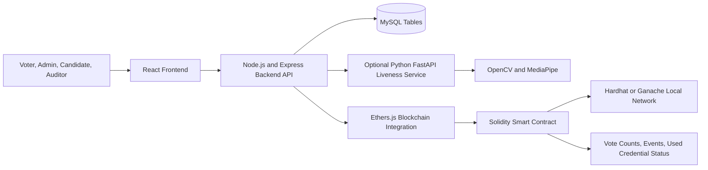
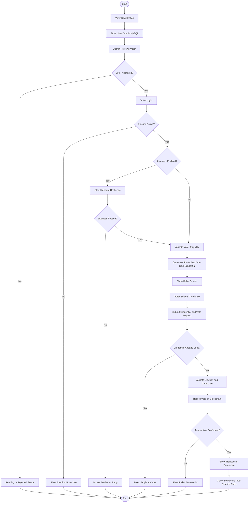
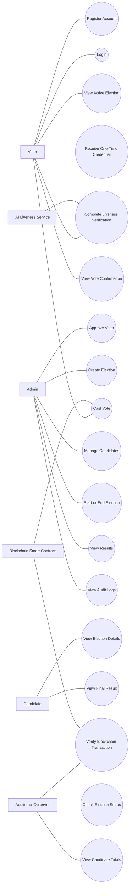
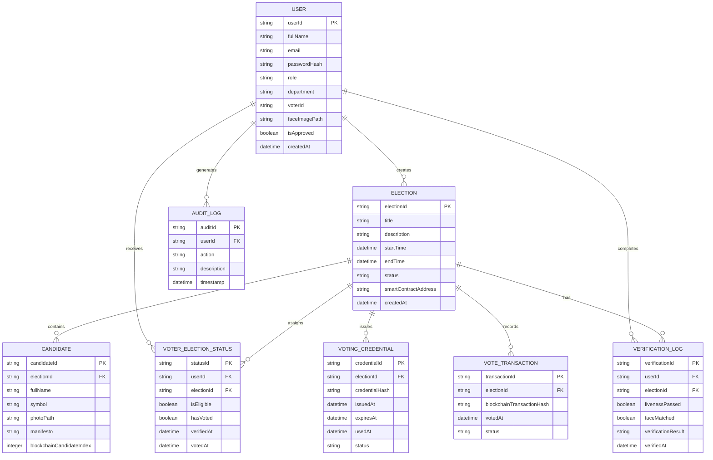
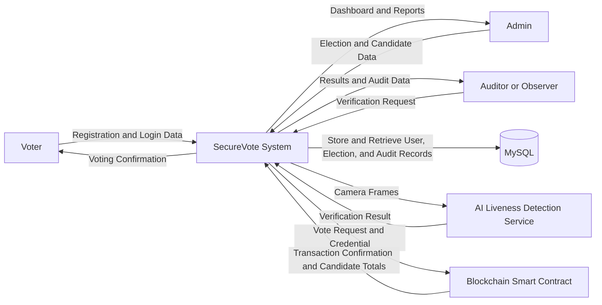
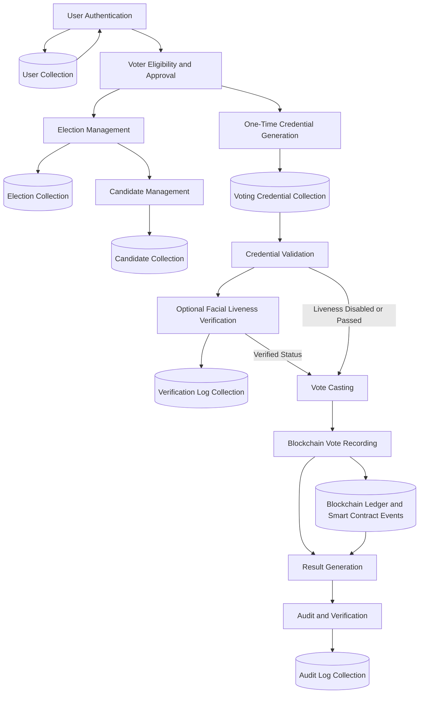

# SecureVote

For the current implementation, local setup, verification steps, and next milestone,
see [DEVELOPMENT.md](DEVELOPMENT.md).

**Implementation update:** the local prototype now includes one-time voting
credentials, Solidity ballot recording, receipt recovery, duplicate-vote protection,
closed-election results, result reconciliation, and administrative audit logs.
Run `npm.cmd run dev` from this directory after setup to start the local stack.
Voter enrollment is now commission-controlled: admins verify and enroll voters,
then privately share a 24-hour, single-use activation link so each voter sets their
own password. Public self-registration is disabled. Automatic invitation delivery
and AI-assisted verification remain planned. The sections below describe the
broader proposal; see DEVELOPMENT.md for the implemented workflow.

## Privacy-Aware Blockchain-Based E-Voting System with Optional AI Liveness Verification

## 1. Abstract

SecureVote is an institutional e-voting prototype for controlled elections in universities,
departments, clubs, and organizations. The system combines secure web authentication, admin
eligibility approval, one-time voting credentials, blockchain vote recording, and an optional
AI-assisted facial liveness verification layer.

The primary contribution is a voting protocol that separates voter identity management from ballot
recording. After an eligible voter is approved, the system issues a short-lived, single-use voting
credential. The credential is used to submit one ballot through a smart contract without storing the
voter's name, email, or institutional ID on the blockchain. Blockchain events and candidate totals
provide an auditable record of accepted votes.

Facial liveness verification is an additional authentication control, not the primary research claim.
The project will use an existing pre-trained computer-vision model rather than train a new model.
This keeps the scope achievable while still demonstrating secure integration of AI, web services,
databases, and blockchain technology.

## 2. Problem Statement

Paper-based and centralized electronic voting systems can require significant manual effort and may
make auditing difficult. A centralized database can also become a single point of failure. Online
voting introduces additional risks, including stolen credentials, duplicate voting, unauthorized
access, and uncertainty about whether a recorded vote was altered.

Basic login authentication does not prove that an approved voter is physically present. However,
facial liveness detection alone does not prove identity and should not be treated as a complete
authentication solution. A practical institutional prototype therefore needs layered controls:
admin approval, secure authentication, optional liveness verification, one-time voting credentials,
smart-contract validation, and audit records.

## 3. Aim

To design and implement a privacy-aware institutional e-voting prototype that prevents duplicate
votes, records ballots in a tamper-evident blockchain ledger, and provides verifiable election
results without exposing unnecessary voter identity information.

## 4. Objectives

1. Build a web-based voting platform for controlled institutional elections.
2. Implement authentication and role-based access for admins, voters, candidates, and auditors.
3. Allow admins to approve eligible voters and manage elections and candidates.
4. Issue short-lived, single-use voting credentials after eligibility verification.
5. Record accepted ballots and candidate totals through a Solidity smart contract.
6. Prevent duplicate voting at both the backend and smart-contract layers.
7. Integrate optional challenge-response liveness verification using a pre-trained model.
8. Separate voter identity records from blockchain ballot records.
9. Provide transaction references, audit logs, and independently readable election totals.
10. Evaluate security, correctness, usability, performance, and liveness behavior.

## 5. Project Contribution

The project does not claim to invent a new facial-recognition model or blockchain protocol. Its
engineering contribution is the design and evaluation of a complete secure voting workflow that
connects multiple components:

- A privacy-aware one-time voting credential protocol.
- Backend authorization that issues a credential only to an approved voter.
- Smart-contract validation that rejects reused credentials and invalid election states.
- Separation of identity data, verification logs, and ballot data.
- Optional challenge-response liveness integrated into voting authorization.
- Audit and reconciliation tools for comparing application results with blockchain totals.
- Controlled experiments measuring correctness, latency, failures, and false approvals or rejections.

## 6. Scope

### 6.1 In Scope

- Voter registration and secure login.
- Admin approval and rejection of voters.
- Election creation, scheduling, and status management.
- Candidate creation and management.
- Eligibility assignment for each election.
- One-time voting credential generation and validation.
- Optional blink or head-movement liveness challenge.
- Solidity smart contract for ballot submission and vote counting.
- Candidate-wise result display after the election ends.
- Transaction reference and audit-log viewing.
- Functional, security, integration, and usability testing.

### 6.2 Out of Scope

- Government or nationwide elections.
- Production public-blockchain deployment.
- Guaranteed anonymity against a fully trusted or malicious election authority.
- Advanced deepfake detection.
- Training a new facial liveness model.
- Hardware biometrics such as fingerprint or iris scanners.
- Zero-knowledge voting or advanced cryptographic anonymous credentials.
- Mobile application development.

## 7. Proposed System

SecureVote uses a React frontend, Node.js and Express backend, MySQL database, optional Python
AI service, and Solidity smart contract deployed on a local Hardhat network. Ethers.js connects the
backend or approved client wallet to the contract.

The database stores users, elections, candidates, eligibility, verification results, and audit
metadata. It does not store the ballot as the authoritative vote record. The smart contract stores
the election state, candidate totals, accepted ballot events, and a non-reversible used-credential
identifier. The implementation must ensure that the credential cannot be reversed into a voter
identity using ordinary application data.

The Solidity smart contract is deployed on the Hardhat or Ganache local blockchain network. Ethers.js
is the integration layer used by the backend to communicate with the deployed contract. The local
blockchain network is not created by the smart contract.

## 8. System Architecture



### 8.1 Frontend

The React application provides registration, login, dashboards, election views, voting, liveness
verification, confirmation, results, and audit screens. Protected routes are controlled by the
backend session and role, not only by frontend visibility.

### 8.2 Backend

The Node.js and Express API handles authentication, role authorization, voter approval, election
management, credential issuance, liveness-session control, smart-contract calls, audit logging, and
error handling. A vote is not marked successful until the blockchain transaction is confirmed.

### 8.3 Database

MySQL stores user profiles, password hashes, election metadata, candidates, voter eligibility,
verification outcomes, and administrative audit logs. Raw webcam frames and direct voter-to-candidate
mappings are not stored. The logical data stores shown in the data-flow diagrams represent tables
within MySQL, not separate physical databases.

### 8.4 Optional AI Liveness Service

The AI service uses OpenCV and a pre-trained MediaPipe face-landmark model. It receives a short,
time-limited frame sequence and checks a random challenge such as two blinks or a head turn. It
returns a liveness result and confidence metadata. Liveness proves live presence; it does not by
itself prove that the person is the registered voter.

### 8.5 Blockchain

The Solidity contract validates election state, candidate identifiers, credential reuse, and vote
submission. It updates candidate totals and emits an event containing the election and candidate
references. The transaction hash is a technical audit reference, not proof of voter identity or
ballot secrecy.

### 8.6 Diagram Source Code

The following Mermaid diagrams are the official diagram source for this proposal. Paste each code
block into the Mermaid Live Editor at https://mermaid.live and export the result as PNG or SVG for
the final report. Use the captions shown below each diagram.

#### Figure 1: System Architecture Diagram


#### Figure 2: System Flow Diagram



#### Figure 3: Use Case Diagram



#### Figure 4: Entity Relationship Diagram



#### Figure 5: Data Flow Diagram Level 0



#### Figure 6: Data Flow Diagram Level 1



## 9. Voting Workflow

1. A voter registers with required institutional information.
2. The admin reviews and approves the voter.
3. The admin creates an election, candidates, schedule, and eligible voter list.
4. The voter logs in and requests access to the active election.
5. The system checks whether liveness verification is enabled for the election.
6. If enabled, the voter completes a random liveness challenge; otherwise, the approved login and
   eligibility checks continue directly.
7. After successful checks, the backend creates a short-lived, single-use voting credential.
8. The voter selects a candidate and submits the credential and ballot request.
9. The smart contract verifies election status, candidate validity, and credential reuse.
10. The contract records the ballot event and updates exactly one candidate total.
11. The backend waits for transaction confirmation and displays the transaction reference.
12. A failed transaction is shown as failed and is not presented as a completed vote.
13. After the election closes, results are read from the smart contract and shown to authorized users.
14. Auditors compare displayed totals with blockchain totals and review permitted audit records.

## 10. Voting Credential Design

The backend must not send a credential containing a voter name, email, or institutional ID to the
smart contract. A credential should be random, short-lived, single-use, and stored only as a secure
hash where possible. The system should record whether the voter has received or used a credential,
but it must avoid creating a database record that directly links a candidate choice to a voter.

This design improves privacy within the prototype, but it does not provide formal cryptographic
anonymity. That limitation will be stated clearly in the report.

The ER diagram includes the following logical entity for this process:

```text
VOTING_CREDENTIAL
- credentialId
- electionId
- credentialHash
- issuedAt
- expiresAt
- usedAt
- status
```

The credential hash is used for one-time validation and must not be used to reconstruct the voter's
identity. The authoritative used-credential check is performed by the smart contract.

## 11. Functional Modules

### Admin Module

Admin login, voter approval, election scheduling, candidate management, status control, result
viewing, and audit-log access.

### Voter Module

Registration, login, eligibility display, optional liveness verification, ballot submission,
confirmation, and election-status viewing.

### Auditor Module

Election status, candidate totals, transaction references, smart-contract events, and reconciliation
results.

### Smart-Contract Module

Election initialization, candidate registration, start and end validation, credential reuse prevention,
vote recording, event emission, and result retrieval.

### Liveness Module

Challenge generation, webcam permission handling, face-landmark processing, timeout, retry limits,
pass/fail logging, configurable enforcement per election, and single-use verification authorization.

## 12. Security Requirements

- Hash passwords with bcrypt or an equivalent password-hashing algorithm.
- Use expiring authentication tokens and protected backend routes.
- Enforce authorization on the backend for every privileged operation.
- Validate all election, candidate, credential, and vote inputs.
- Use a single-use credential and enforce reuse prevention in the smart contract.
- Do not store raw webcam video or unnecessary biometric data.
- Do not expose direct voter-to-candidate mappings in ordinary audit views.
- Do not report a vote as successful before blockchain confirmation.
- Record failed transactions and prevent unsafe automatic retries.
- Log important admin actions without logging passwords or raw camera frames.
- Protect AI-service endpoints from unauthenticated requests and oversized uploads.

## 13. Threat Model

The evaluation will consider credential theft, account sharing, photo or video replay, duplicate
submissions, unauthorized admin actions, database compromise, smart-contract defects, AI-service
failure, and blockchain outage. Controls will include password hashing, admin approval, challenge-
response liveness, short-lived credentials, role checks, contract validation, audit logs, input
limits, transaction confirmation, and explicit failure states.

The project will not claim to solve advanced deepfakes, coercion, malicious election authorities,
or all forms of endpoint compromise. These are documented limitations rather than hidden assumptions.

## 14. Non-Functional Requirements

- Security: unauthorized users cannot access protected election operations.
- Correctness: one accepted request increments only one valid candidate total.
- Reliability: failed transactions do not appear as completed votes.
- Privacy: unnecessary identity and biometric data is not placed on-chain.
- Usability: a voter can understand the status of eligibility, verification, and submission.
- Maintainability: frontend, backend, AI service, and blockchain modules can be tested separately.
- Performance: normal voting confirmation should complete within a documented target on the local network.

## 15. Technology Stack

- Frontend: React, JavaScript/JSX, Vite, and browser webcam APIs (planned for optional liveness).
- Backend: Node.js, Express, JWT-based authentication, and bcrypt.
- Database: MySQL and mysql2.
- AI integration: Python, FastAPI, OpenCV, and MediaPipe.
- Blockchain: Solidity, Hardhat, and Ethers.js.
- Testing: smart-contract unit tests, API tests, integration tests, and browser workflow tests.

## 16. Testing and Evaluation

The system will be tested using the following cases:

| Test case                        | Expected result                                 |
| -------------------------------- | ----------------------------------------------- |
| Valid voter registration         | Account is created successfully                 |
| Wrong password                   | Login is rejected                               |
| Unapproved voter requests ballot | Access is denied                                |
| Valid liveness challenge         | Verification passes                             |
| Photo, video, or no face         | Verification fails or remains incomplete        |
| First valid vote                 | One confirmed blockchain transaction is created |
| Reused credential                | Smart contract rejects the request              |
| Invalid candidate                | Smart contract rejects the request              |
| Vote outside election time       | Submission is rejected                          |
| Failed blockchain transaction    | Vote is not shown as completed                  |
| Results after election close     | Totals match smart-contract data                |
| Unauthorized admin endpoint      | Request is rejected                             |

Evaluation will report successful test cases, transaction confirmation time, liveness pass and fail
counts, retry behavior, duplicate-vote rejection, and consistency between the dashboard and contract
totals. Testing will use controlled institutional data and will not claim production-election security.

## 17. Implementation Methodology

The project will use incremental development:

1. Implement authentication, roles, and voter approval.
2. Implement election and candidate management.
3. Implement the smart contract and test it independently.
4. Connect the backend to the contract and complete voting.
5. Add one-time voting credentials and audit records.
6. Integrate optional liveness verification.
7. Add failure handling, privacy checks, and protected routes.
8. Perform integration testing, evaluation, and documentation.

The voting MVP will be completed before optional AI enhancements are attempted.

## 18. Minimum Viable Product

The MVP consists of admin login, voter registration and approval, election creation, candidate
management, voter login, eligibility validation, one-time voting credentials, blockchain vote
casting, duplicate-vote prevention, result display, transaction references, and audit verification.

Optional liveness verification will be included if it passes the defined tests. If the AI service is
not sufficiently reliable, the report will present it as an evaluated extension and retain secure
admin approval and authentication for the core MVP.

## 19. Expected Outcomes

The completed project will deliver a working institutional e-voting prototype, tested smart contract,
privacy-aware voting workflow, secure admin and voter dashboards, optional AI liveness integration,
auditable blockchain totals, documented limitations, and reproducible test results.

## 20. Limitations and Future Work

The prototype uses a local blockchain and controlled users. It does not provide formal anonymous
voting, nationwide scalability, guaranteed deepfake resistance, coercion resistance, or protection
against every compromised device. Future work may include anonymous credentials, zero-knowledge
proofs, advanced anti-spoofing models, public or permissioned blockchain deployment, mobile support,
and independent security auditing.

## 21. Proposed Timeline

| Phase               | Work                                                          |
| ------------------- | ------------------------------------------------------------- |
| Semester 7, Phase 1 | Requirements, literature review, threat model, and diagrams   |
| Semester 7, Phase 2 | Authentication, roles, voter approval, and database           |
| Semester 7, Phase 3 | Election management and candidate modules                     |
| Semester 7, Phase 4 | Smart contract development and unit testing                   |
| Semester 8, Phase 1 | Backend integration and complete voting workflow              |
| Semester 8, Phase 2 | Voting credentials, audit tools, and privacy checks           |
| Semester 8, Phase 3 | Optional liveness integration and evaluation                  |
| Semester 8, Phase 4 | System testing, final report, presentation, and demonstration |

## 22. Conclusion

SecureVote is a realistic and technically substantial engineering project. Its primary contribution
is not claiming to invent facial AI or blockchain. It is the design, implementation, security, and
evaluation of a privacy-aware voting workflow that combines eligibility control, one-time credentials,
smart-contract validation, auditability, and optional AI-assisted liveness verification.

The project is intentionally limited to controlled institutional elections. This boundary makes the
system achievable within the 7th and 8th semesters and allows the team to demonstrate a complete,
tested prototype instead of making unsupported claims about national election infrastructure.
PROJECT PROPOSAL
Blockchain-Based Secure E-Voting System with AI Facial Liveness Detection

Project Name: SecureVote
Project Type: Institutional e-voting prototype
Primary Goal: Provide verifiable vote recording while preventing unauthorized and duplicate voting.

Important Boundary
This is an academic prototype for controlled institutional elections. It is not intended for government
elections or as a replacement for certified election infrastructure. The prototype prioritizes eligibility
verification, one-voter-one-vote enforcement, auditability, and separation between voter identity data
and ballot data. It does not claim complete anonymity against every authority or advanced cryptographic
privacy guarantees.

 

1. Introduction
   Voting is an important decision-making process in educational institutions, organizations, companies, clubs, and public bodies. Traditional voting methods such as paper-based voting and centralized electronic voting systems often face several problems including high management cost, slow counting process, limited accessibility, human error, physical security risks, and lack of transparent auditing. Paper-based voting requires voters to be physically present, requires more manpower, and takes time for vote counting and result publication.
   With the growth of digital systems, online voting can provide better accessibility, faster vote counting, and easier election management. However, online voting also introduces new security challenges. A centralized online voting system usually stores vote records in a central database. If the database or server is compromised, vote records may be changed, deleted, or manipulated. Similarly, password-based authentication may not be enough because credentials can be shared, stolen, or misused.
   Another important challenge in remote voting is identity verification. A user may try to vote using someone else’s credentials, or attackers may attempt to bypass face verification using printed photographs, recorded videos, or digital screen replay attacks. Therefore, a secure voting system should not only verify login credentials but also check whether the real voter is physically present during voting.
   This project proposes a secure prototype of an institutional-level e-voting system using blockchain and AI-based facial liveness detection. Blockchain technology is used to record ballot data and election totals in an immutable and verifiable manner, reducing dependency on a single centralized vote database. AI facial liveness detection is used to verify that a real person is present before allowing vote casting. Liveness detection alone does not prove that the person is the registered voter; optional face matching is treated as a separate identity-verification feature.
   The proposed system is mainly designed for controlled elections such as college elections, university department elections, student council elections, club elections, corporate elections, and organizational voting. It combines full-stack web development, blockchain smart contracts, computer vision, database management, and secure authentication to provide a transparent, secure, and technically strong voting platform.

2. Problem Statement
   Existing voting systems face several technical and operational challenges. Paper-based voting requires physical presence, manual effort, human resources, and proper ballot security. The process is time-consuming and may introduce human error during vote counting and result preparation.
   Centralized electronic voting systems reduce manual work, but they still depend heavily on a central authority and centralized database. If the database or server is compromised, votes may be manipulated without easy public verification. This creates a trust issue between voters and election authorities.
   Remote online voting systems also face voter authentication problems. Password-based login and basic multi-factor authentication may not be sufficient because users can share credentials or attackers can steal them through phishing. Basic face verification without liveness detection can also be vulnerable to spoofing attacks using photos, recorded videos, or digital screens.
   Another major issue is auditability. In many online voting systems, voters and observers must trust the internal software without any independent verification mechanism. There is often no transparent way to verify whether votes were recorded and counted correctly.
   Therefore, there is a need for a secure, transparent, and verifiable e-voting platform that can authenticate voters, prevent duplicate voting, protect voting records from manipulation, and provide an auditable result generation mechanism.

3. Objectives of the Project
   The main objective of this project is to develop a blockchain-based secure e-voting system with AI facial liveness detection for institutional-level elections.
   The specific objectives are:
   To design and develop a web-based e-voting platform for institutional elections.
   To implement role-based access for admin, voter, candidate, and auditor or observer.
   To allow election authorities to create elections, manage candidates, approve voters, and monitor election status.
   To implement AI-based facial liveness detection to verify that the voter is a real live person before voting.
   To reduce spoofing attempts using photo or video-based attacks through active liveness verification such as blink detection or head movement detection.
   To implement blockchain-based vote recording using smart contracts.
   To prevent duplicate voting by enforcing a one-voter-one-vote rule.
   To generate election results automatically after voting ends.
   To provide transaction-based vote verification and auditability.
   To separate voter identity verification from vote recording as much as possible within the scope of an academic prototype.
   To evaluate the system through controlled testing of voting workflow, liveness detection, smart contract execution, duplicate vote prevention, and result generation.

4. Scope of the Project
   The scope of this project is limited to the design and development of a secure prototype for institutional-level elections. The system will be suitable for small to medium-scale controlled voting environments such as university elections, department representative elections, student council elections, club elections, corporate elections, and organizational voting.
   4.1 Within Scope
   The project includes the following features:
   Voter registration and login.
   Admin approval of eligible voters.
   Election creation and management.
   Candidate registration and management.
   AI-based facial liveness detection before vote casting.
   Basic face verification using registered voter information, if feasible during implementation.
   Blockchain-based vote recording using Solidity smart contracts.
   One-voter-one-vote validation.
   Automatic result calculation.
   Transaction hash generation for vote verification.
   Admin dashboard for election management.
   Voter dashboard for voting and election status.
   Auditor or observer view for result and transaction verification.
   Database storage for user profiles, candidate information, election details, and verification status.

4.2 Outside Scope / Future Work
The following features are outside the current scope and may be considered as future enhancements:
Nationwide public election deployment.
Integration with government voter ID systems.
Large-scale public blockchain deployment.
Advanced zero-knowledge proof-based anonymous voting.
Advanced deepfake detection against highly realistic AI-generated video attacks.
Hardware biometric devices such as fingerprint scanner or iris scanner.
Mobile application version.
Large-scale load balancing for millions of voters.

5. Proposed System
   The proposed system, named SecureVote, is a blockchain-based e-voting platform with AI facial liveness detection. The system verifies voter eligibility and live presence before voting, then records the ballot through a blockchain smart contract to improve transparency and immutability.
   The system follows a modular architecture consisting of a React.js frontend, Node.js/Express.js backend, MySQL database, Python-based computer vision service, and Solidity smart contract deployed on a local blockchain network using Hardhat or Ganache.
   The voter first registers in the system and provides required identity information along with a reference face image. The admin verifies and approves eligible voters. When an election becomes active, the voter logs in and performs facial liveness verification through the webcam. The AI module checks whether the voter is a live person by detecting actions such as eye blink or head movement. After successful verification, the system allows the voter to cast a vote.
   The vote is submitted to a blockchain smart contract, which records the ballot choice without storing the voter's name, email, or institutional ID on-chain. The system prevents the same authorized voting credential from voting more than once. A blockchain transaction hash is generated as a technical submission reference, not as proof of voter identity or ballot secrecy. After the election ends, the result can be viewed through the dashboard and transaction records can be verified for audit purposes.

6. Working Mechanism of the Proposed System
   The proposed system works through a secure step-by-step voting process. The main purpose of the system is to verify the voter, prevent duplicate voting, and record votes in a tamper-resistant blockchain ledger.
   First, the voter registers through the web application by providing required personal and institutional information such as name, email, voter ID, department, and reference face image. The registration data is stored in the MySQL database. The admin verifies the voter details and approves only eligible voters.
   After voter approval, the admin creates an election by adding election title, description, start date, end date, candidates, and eligible voter list. Candidates are also registered with their name, photo or symbol, and manifesto or description.
   When the election becomes active, the voter logs into the system. Before accessing the voting screen, the voter must complete AI-based facial liveness verification. The system opens the webcam and asks the voter to perform a simple live action such as blinking eyes or turning the head. The Python-based AI service processes the camera frames and verifies whether the voter is a live person. If face matching is included, the current face is compared with the registered face image.
   If the voter passes the liveness verification, the backend generates a short-lived permission for voting. The voter then selects a candidate and submits the vote. The vote is recorded through a blockchain smart contract. The smart contract checks whether the authorized voting credential has already been used. If it has not been used, the vote is accepted and the candidate vote count is updated. A blockchain transaction hash is generated as a technical submission reference. The credential must not contain directly identifying information or be reversible using ordinary database data.
   After the voting period ends, the system displays the result based on the vote count stored in the blockchain. Admin, voters, and auditors can verify election results through transaction records and candidate-wise vote counts.

7. System Workflow
   The workflow of the proposed system is as follows:
8. Voter registers in the system.
9. Admin verifies and approves the voter.
10. Admin creates election.
11. Admin adds candidates.
12. Election becomes active at scheduled time.
13. Voter logs into the system.
14. Voter completes AI facial liveness detection.
15. System verifies voter eligibility.
16. Voter selects a candidate.
17. Vote is submitted to blockchain smart contract.
18. Smart contract checks duplicate voting.
19. Vote is recorded and transaction hash is generated.
20. Result is calculated after election ends.
21. Auditor or observer verifies result using blockchain transaction records.

22. System Architecture
    The proposed system consists of five main layers.
    8.1 Frontend Layer
    The frontend layer will be developed using React.js. It provides the user interface for voters, admins, candidates, and auditors. Voters can register, login, verify their identity, view elections, and cast votes. Admins can manage elections, candidates, and voters. Auditors can view election results and blockchain transaction details.
    8.2 Backend Layer
    The backend will be developed using Node.js and Express.js. It handles authentication, authorization, API routing, election management, candidate management, voter approval, and communication between the frontend, database, AI service, and blockchain service.
    8.3 Database Layer
    MySQL will be used to store non-vote data such as user profiles, voter details, candidate details, election information, admin records, and verification status. The actual vote record and vote count will be handled through the blockchain smart contract.
    8.4 AI Facial Liveness Detection Layer
    A Python-based microservice will be developed using OpenCV, MediaPipe or Dlib, and FastAPI. This service will process webcam input and check whether the voter is physically present and alive. The liveness detection may include blink detection, head movement detection, or random action verification. Face matching may also be used to compare the current voter with the registered face image if feasible.

8.5 Blockchain Layer
The blockchain layer will be implemented using Solidity smart contracts and a local blockchain environment such as Hardhat or Ganache. The smart contract will handle vote casting, candidate vote count, duplicate vote prevention, election status, and result generation. Ethers.js will be used to connect the web application with the smart contract.

 

9. System Architecture Diagram

Fig : System Architecture Design 

 The system architecture diagram shows the overall structure of the SecureVote system. The React.js frontend provides separate dashboards for voters, admins, candidates, and auditors/observers. The Node.js/Express.js backend API acts as the main server-side component and handles communication between the frontend, MySQL database, AI service, and blockchain module.
 MySQL is used to store user information, election details, candidate records, and verification-related data. The Python FastAPI service performs AI-based facial liveness detection using OpenCV/MediaPipe to verify whether the voter is physically present before voting. The blockchain module uses Ethers.js to communicate with the Hardhat/Ganache local blockchain environment, where the Solidity smart contract is deployed.
 The Solidity smart contract manages vote recording, vote count, voting status, and transaction hash generation. This architecture helps ensure secure voter verification, organized data management, transparent vote recording, and verifiable election results.

  10. System Flow Diagram

 
 The system flow diagram represents the complete working process of the proposed SecureVote system. The process starts with voter registration, where the voter enters required details into the system. After registration, the voter data is stored in the MySQL database. Then the admin verifies the voter information. If the voter is not approved, the system shows a reject or pending status and the process ends. If the voter is approved, the voter can proceed to login.
 After successful login, the system checks whether there is an active election. If no election is active, the system displays an election not active message and ends the process. If an election is active, the voter starts webcam verification. The system then performs AI facial liveness detection to confirm that the voter is a real live person and not using a photo, video, or spoofing method.
 After liveness detection, the system checks whether the liveness verification is passed. If the verification fails, access is denied and the process ends. If the verification passes, the ballot screen is displayed to the voter. The voter then selects a candidate and submits the vote to the smart contract.
 Before recording the vote, the system checks whether the voter has already voted. If the voter has already voted, the system rejects the duplicate vote and ends the process. If the voter has not voted before, the vote is recorded on the blockchain. After successful recording, a transaction hash is generated, and the system shows vote confirmation to the voter. Finally, after the election ends, the result is generated and the process is completed.
 This flow ensures voter approval, active election validation, facial liveness verification, duplicate vote prevention, blockchain-based vote recording, transaction hash generation, and secure result generation.

  11. Use Case Diagram

Figure: Use Case Diagram of SecureVote System
 The use case diagram represents the interaction between the SecureVote system and its different actors. The main actors of the system are Voter, Admin, Candidate, Auditor/Observer, AI Liveness Detection Service, and Blockchain Smart Contract. The system boundary represents the main SecureVote system, and the oval shapes inside the boundary represent the functions provided by the system.
 The Voter can register an account, login, perform facial liveness verification, view active elections, cast vote, and view vote confirmation. Before casting a vote, the voter must complete AI-based facial liveness verification to ensure that the voter is a real live person and not using a photo or video spoofing method.
 The Admin manages the overall election process. The admin can approve voters, create elections, manage candidates, start or end elections, view results, and view audit logs. This helps the admin control and monitor the election process properly.
 The Candidate can view election details and view the final result after the election is completed. The Auditor/Observer is responsible for transparency and verification. The auditor can verify blockchain transactions, view candidate-wise vote count, and check election status.
 The AI Liveness Detection Service supports the facial liveness verification process. It helps verify the real presence of the voter before allowing access to the ballot. The Blockchain Smart Contract supports secure vote recording and blockchain transaction verification. It helps record votes, prevent duplicate voting, and provide transaction details for verification.
 Overall, this use case diagram shows how the SecureVote system supports secure voter registration, voter verification, election management, vote casting, blockchain-based verification, result viewing, and audit monitoring.

12. ER Diagram

Figure: Use Case Diagram of SecureVote System

 The ER diagram represents the database structure of the proposed SecureVote system. It shows the main entities required to manage users, elections, candidates, voter election status, vote transactions, verification records, and audit logs. The main entities are User, Election, Candidate, Voter_Election_Status, Vote_Transaction, Verification_Log, And Audit_Log.
 The USER entity stores details of system users such as voters, admins, candidates, and auditors. It includes information such as user ID, full name, email, password hash, role, department, voter ID, face image path, approval status, and account creation date. The ELECTION entity stores election-related information such as election ID, title, description, start time, end time, status, admin who created the election, smart contract address, and creation date.
 The CANDIDATE entity stores candidate details for a particular election, including candidate ID, election ID, full name, symbol, photo path, manifesto, and blockchain candidate index. The VOTER_ELECTION_STATUS entity manages election-wise voter eligibility and voting status. This entity is important because one user may participate in multiple elections, so voting status such as eligibility and whether the user has voted must be stored separately for each election.
 The VOTE_TRANSACTION entity stores blockchain-related voting records such as transaction ID, election ID, voter hash, candidate hash, blockchain transaction hash, voting time, and transaction status. The VERIFICATION_LOG entity stores AI facial liveness verification records, including liveness result, face matching result, verification result, and verification time. The AUDIT_LOG entity records important activities performed in the system, such as voter approval, election creation, candidate management, verification, and other security-related actions.
 The relationships show that one user can create many elections, generate many audit logs, have many voter-election status records, and have many verification logs. Similarly, one election can contain many candidates, include many voter-election status records, store many vote transactions, and record many verification logs. This design separates user identity, election data, voting status, verification records, and blockchain transaction details, making the system organized, secure, and suitable for institutional-level e-voting.
.

 

13. Data Flow Diagram Level 0

Figure : Data Flow Diagram Level 0 of SecureVote System

 The Data Flow Diagram Level 0 represents the overall data flow of the SecureVote system. It shows the SecureVote system as the main central process and explains how it interacts with external entities and supporting services. The main external entities are Voter, Admin, Auditor/Observer, MySQL Database, AI Liveness Detection Service, and Blockchain Smart Contract.
 The Voter sends registration and login data to the SecureVote system and receives voting confirmation after the vote is successfully recorded. The Admin provides election and candidate data to the system and receives dashboard and report information. The Auditor/Observer receives result and audit data from the system to verify transparency and election status.
 The SecureVote system stores and retrieves user and election records from the MySQL database. For voter identity verification, the system sends camera frames to the AI Liveness Detection Service, which returns the verification result. After successful verification, the system sends a vote request to the Blockchain Smart Contract. The smart contract returns the transaction hash and vote count, which helps make the voting process secure, transparent, and verifiable.
 Overall, the Level 0 DFD provides a high-level view of how data moves between the main system, users, database, AI verification service, and blockchain smart contract.

14. Data Flow Diagram Level 1

Figure : Data Flow Diagram Level 1 of SecureVote System
 The Data Flow Diagram Level 1 shows the internal processing flow of the SecureVote system in more detail. It breaks down the main SecureVote system into smaller functional processes such as User Authentication, Voter Approval, Election Management, Candidate Management, Facial Liveness Verification, Vote Casting, Blockchain Vote Recording, Result Generation, and Audit and Verification.
 The process begins with User Authentication, where the user information is checked using the User Database. After authentication, the Voter Approval process verifies whether the voter is eligible to participate in the election. Election Management handles election-related information and communicates with the Election Database, while Candidate Management manages candidate details using the Candidate Database.
 Before voting, the voter must complete Facial Liveness Verification. The result of this verification is stored in Verification Logs. If the voter is successfully verified, the system allows the voter to proceed with Vote Casting. The vote details are then passed to the Blockchain Vote Recording process, where the vote is stored in the Blockchain Ledger.
 After the vote is recorded, the Result Generation process prepares the election result. Finally, the Audit and Verification process checks voting records, result data, and system activities. Audit-related information is stored in Audit Logs to support transparency, accountability, and verification of the election process.
 Overall, the Level 1 DFD explains the internal working of the SecureVote system and shows how authentication, voter approval, election management, AI verification, blockchain vote recording, result generation, and auditing are connected.

  15. Functional Modules
15.1 Admin Module
The admin module allows election authorities to manage the overall voting process. Admin can create elections, add candidates, approve voters, start or stop elections, view voting status, and generate reports.
Main features:
Admin login.
Voter approval and management.
Candidate management.
Election creation and scheduling.
Election status management.
Result monitoring.
Audit log viewing.
15.2 Voter Module
The voter module allows eligible users to participate in elections. Voters can register, login, complete liveness verification, cast vote, and view voting confirmation.
Main features:
Voter registration.
Secure login.
Election list view.
Facial liveness verification.
Vote casting.
Voting confirmation.
Transaction hash viewing.

15.3 Candidate Module
The candidate module stores and displays candidate information for each election.
Main features:
Candidate profile.
Candidate photo or symbol.
Election-wise candidate listing.
Candidate manifesto or description.
Vote count after result publication.
15.4 AI Verification Module
This module verifies the voter before voting.
Main features:
Webcam-based face detection.
Blink detection.
Head movement detection.
Optional face matching.
Liveness pass/fail result.
Verification status update.
15.5 Blockchain Voting Module
This module handles secure vote recording.
Main features:
Smart contract deployment.
Candidate registration in smart contract.
Vote casting through blockchain.
Duplicate vote prevention.
Vote count update.
Transaction hash generation.
Result retrieval from blockchain.
15.6 Auditor/Observer Module
This module allows transparency and verification.
Main features:
Election result viewing.
Vote transaction verification.
Candidate-wise vote count.
Election status viewing.
Blockchain transaction hash viewing.

  16. Methodology
The development methodology of the proposed system will follow a modular and incremental approach.
16.1 Requirement Analysis
In this phase, the functional and non-functional requirements of the system will be identified. The requirements will include user roles, voting workflow, security needs, authentication process, blockchain requirements, and AI liveness verification requirements.
16.2 System Design
System design will include use case diagrams, data flow diagrams, database schema, system architecture diagram, smart contract design, and module design. The system will be designed to separate voter identity management from vote recording.
16.3 Frontend and Backend Development
The frontend will be developed using React.js, and the backend will be developed using Node.js and Express.js. REST APIs will be created for user registration, login, voter approval, election creation, candidate management, and voting workflow.
16.4 Database Implementation
MySQL will be used to store system data such as voters, admins, candidates, elections, and verification records. Proper schema design will be followed to maintain data consistency.
16.5 AI Liveness Detection Implementation
The AI module will be implemented as a separate Python microservice. It will process webcam frames and check for liveness indicators such as blinking or head movement. The system may use facial landmarks to detect eye movement and facial orientation. If the voter passes the liveness test, the backend will allow the voting process to continue.
16.6 Blockchain Smart Contract Development
A Solidity smart contract will be developed to manage vote casting and vote counting. The smart contract will include functions for candidate registration, vote casting, duplicate vote prevention, and result retrieval. It will be tested using Hardhat or Ganache.
16.7 System Integration
After developing individual modules, the system will be integrated. The React frontend will communicate with the Node.js backend. The backend will communicate with the Python AI service and blockchain smart contract. The voting button will be enabled only after successful voter authentication and liveness verification.
16.8 Testing and Evaluation
The system will be tested using controlled test cases. Testing will include user authentication testing, voter approval testing, election creation testing, liveness detection testing, smart contract testing, duplicate voting prevention testing, result calculation testing, and security testing.

  17. Smart Contract Working Logic
The smart contract will be responsible for secure vote recording and vote counting. It will contain election-related data such as candidate list, vote count, voting status, and voter participation status. The smart contract ensures that a voter cannot vote more than once in the same election.
Basic smart contract workflow:

1. Admin deploys or initializes the smart contract.
2. Admin adds candidates to the contract.
3. Voting starts according to election status.
4. Voter submits vote request after successful verification.
5. Smart contract checks whether the voter has already voted.
6. If the voter has not voted, the vote is recorded.
7. Candidate vote count is increased.
8. A blockchain event is emitted.
9. Transaction hash is returned as a technical submission reference.
10. Result is retrieved after election ends.
    Pseudo logic:
    IF election is active:
    IF voter has not voted:
    accept vote
    increase candidate vote count
    mark voter as voted
    generate transaction hash
    ELSE:
    reject duplicate vote
    ELSE:
    reject vote request

11. AI Liveness Detection Working Logic
    The AI liveness detection module verifies whether the voter is a real live person. The system uses the webcam to capture face frames and checks facial movements.
    Basic liveness verification workflow:
12. Voter opens verification screen.
13. Webcam starts capturing frames.
14. System detects face landmarks.
15. System asks voter to perform an action such as blinking or turning head.
16. AI service checks whether the required action was completed.
17. If liveness is confirmed, verification is passed.
18. Backend unlocks the voting screen.
19. If liveness fails, voting access is denied.
    Pseudo logic:
    Start webcam
    Detect face
    Ask user to blink or move head
    Track eye aspect ratio or facial landmarks
    IF required movement is detected:
    return liveness passed
    ELSE:
    return liveness failed

20. Database Design Explanation
    The database stores non-vote information required for the system. User data, candidate details, election information, verification logs, and audit logs are stored in MySQL. Blockchain is used for vote recording and vote count to improve immutability and auditability.
    The user collection stores voter, admin, candidate, and auditor information. The election collection stores election title, description, start time, end time, and status. The candidate collection stores candidate information for each election. The verification log collection stores liveness detection results. The vote transaction collection stores transaction hash and status, but it should avoid storing direct voter-to-candidate mapping in plain form. The audit log collection stores important system actions performed by admins and users.

21. Non-Functional Requirements
    20.1 Security
    The system should use secure authentication, password hashing, role-based access control, protected routes, input validation, and blockchain-based vote recording.
    20.2 Reliability
    The system should perform consistently during election creation, voter verification, vote casting, and result generation.
    20.3 Usability
    The interface should be simple and understandable for voters, admins, and observers.
    20.4 Transparency
    The blockchain transaction records should provide an auditable voting trail without exposing unnecessary personal information.
    20.5 Maintainability
    The system should be modular so that frontend, backend, AI service, and blockchain components can be modified independently.
    20.6 Scalability
    The prototype will be designed for institutional-level use. Large-scale public election deployment will be considered future work.

22. Security Mechanisms
    The proposed system includes the following security mechanisms:
    Password hashing using bcrypt.
    JWT-based authentication.
    Role-based access control.
    Protected admin, voter, and auditor routes.
    Admin approval for eligible voters.
    AI facial liveness detection before voting.
    One-voter-one-vote rule.
    Smart contract validation.
    Blockchain transaction hash verification.
    Audit logs for important system activities.
    Separation of voter identity data and blockchain vote record.
    Input validation in backend APIs.
    Election start and end time validation.

22.1 Security Threat Model
The prototype will consider the following threats and controls:
Credential theft or account sharing: use password hashing, JWT expiration, protected routes, and voter approval.
Photo, video, or screen replay: use challenge-based liveness actions such as blinking or head movement.
Duplicate voting: enforce one-use voting credentials in the smart contract and repeat the check in the backend.
Database compromise: do not store ballots or direct voter-to-candidate mappings in MySQL, and never log raw camera frames.
Malicious administrators: restrict administrative actions with role-based authorization and record them in audit logs.
Smart-contract defects: test election status, candidate validation, duplicate voting, unauthorized calls, and result calculation.
Blockchain or service outage: do not mark a vote successful until the transaction is confirmed, and prevent unsafe retries.

22.2 Measurable Acceptance Criteria
The MVP will be considered complete when:
A valid voter can register, be approved by an admin, and log in successfully.
An unapproved voter cannot access an active ballot.
A voter must pass the configured liveness challenge before the ballot is enabled.
A first valid vote creates one confirmed blockchain transaction and updates exactly one candidate count.
A repeated vote from the same election credential is rejected by the smart contract.
Votes cannot be submitted before the election start time or after the election end time.
A failed blockchain transaction is displayed as failed and is not presented as a completed vote.
Application results match the candidate totals returned by the smart contract.
Audit records contain administrative actions without storing raw webcam frames or direct voter-to-candidate mappings.

23. Technology Stack
    22.1 Frontend
    React.js
    Tailwind CSS
    HTML5 Webcam API / react-webcam
    22.2 Backend
    Node.js
    Express.js
    JWT Authentication
    bcrypt password hashing
    22.3 Database
    MySQL
    mysql2
    22.4 AI / Computer Vision
    Python
    FastAPI
    OpenCV
    MediaPipe or Dlib
    Face recognition library, if required
    22.5 Blockchain
    Solidity
    Hardhat or Ganache
    Ethers.js
    Local Ethereum test network
    22.6 Development Tools
    Git and GitHub
    Postman
    Visual Studio Code
    MySQL Workbench
    Browser Developer Tools

24. Hardware and Software Requirements
    23.1 Hardware Requirements
    Laptop or desktop computer.
    Minimum 8 GB RAM.
    Webcam or built-in camera.
    Internet connection.
    Modern web browser.
    23.2 Software Requirements
    Visual Studio Code.
    Node.js.
    MySQL 8.0 or later.
    Python 3.10 or above.
    OpenCV.
    MediaPipe or Dlib.
    FastAPI.
    Solidity compiler.
    Hardhat or Ganache.
    Ethers.js.
    Postman.
    Git and GitHub.

25. Gantt Chart / Project Timeline
    The project will be completed in approximately eight months. The development will follow an incremental model where the basic React, Express, Node.js, and MySQL system is developed first, followed by blockchain integration, AI liveness detection, testing, documentation, and final presentation.

Activities
Jun Jul Aug Sep Oct Nov Dec Jan Feb
Requirement Analysis and Proposal
Literature Review and Feasibility
System Design and Diagrams
Authentication and Role Access
Admin Dashboard
Voter and Candidate Modules
Election Management Module
Solidity Smart Contract Development
Blockchain Integration with Ethers.js
Facial Liveness Detection Module
AI Backend Integration
Result and Audit Dashboard
Testing and Debugging
Final Report and Documentation

  26. Testing Plan
The system will be tested using functional, security, integration, and usability testing.
Test Case Expected Result
User registration with valid details Account should be created successfully
Login with wrong password Login should be rejected
Admin approval of voter Voter should become eligible
Unapproved voter tries to vote Voting access should be denied
Election creation by admin Election should be created successfully
Candidate addition Candidate should appear in election
Voter performs correct liveness action Verification should pass
Voter uses photo or no face Verification should fail
Voter casts vote first time Vote should be recorded on blockchain
Same voter tries to vote again Vote should be rejected
Election time has ended Vote casting should be disabled
Result generation Candidate-wise vote count should be displayed
Transaction hash verification Valid transaction should be displayed
Unauthorized user accesses admin page Access should be denied

  27. Risk Analysis and Mitigation
Risk Impact Mitigation
Blockchain integration becomes difficult Project delay First build React, Express, Node.js, and MySQL voting system, then integrate smart contract
Dlib or face recognition installation issues AI module delay Use OpenCV and MediaPipe as simpler alternative
Liveness detection fails in poor lighting Verification error Test under proper lighting and mention limitation
Vote privacy questions in viva Defense difficulty Clearly explain separation of identity verification and vote recording
Smart contract bugs Incorrect vote count Perform unit testing with Hardhat
Team lacks Web3 experience Slow development Keep blockchain logic simple and focus on vote recording
Too many features Incomplete project Keep advanced features as future enhancement

28. Minimum Viable Product
    The minimum complete version of the project will include:
    Admin login and dashboard.
    Voter registration and approval.
    Election creation.
    Candidate management.
    Voter login.
    Facial liveness detection.
    Blockchain-based vote casting.
    One-voter-one-vote validation.
    Transaction hash generation.
    Result display.
    Audit or verification page.
    This version will be considered the core working system.

29. Optional Advanced Features
    The following features may be added if time permits:
    Face matching with registered image.
    Email or OTP verification.
    QR-based voter identity.
    Public testnet deployment.
    Advanced anti-spoofing model.
    Result export as PDF.
    Multilingual interface.
    Mobile responsive interface.
    Advanced analytics dashboard.

30. Feasibility Study
    30.1 Technical Feasibility
    The project is technically feasible using available open-source technologies such as React.js, Node.js, MySQL, Python, OpenCV, MediaPipe, Solidity, Hardhat, and Ethers.js. The system will be developed as a controlled prototype and tested on a local blockchain network.
    30.2 Operational Feasibility
    The system is suitable for institutional environments where the number of voters is limited and controlled. Admins can manage elections and voters through a dashboard, while voters can participate using a web browser and webcam.
    30.3 Economic Feasibility
    The project can be developed using free and open-source tools. No special hardware is required except a standard webcam. Local blockchain testing avoids real transaction costs.
    30.4 Schedule Feasibility
    The project can be completed within the 7th and 8th semester timeline if development is divided into modules such as React, Express, Node.js, and MySQL system development, AI liveness detection, blockchain smart contract, integration, testing, and documentation.

31. Expected Outcomes
    After successful completion, the project is expected to deliver:
    A working full-stack e-voting web application.
    A secure voter registration and approval system.
    AI-based facial liveness detection for voter verification.
    A blockchain smart contract for vote recording and vote counting.
    A one-voter-one-vote mechanism.
    Automatic election result generation.
    A transaction-based verification system.
    Admin, voter, candidate, and auditor dashboards.
    Technical documentation including system design, testing, limitations, and future scope.
    A prototype suitable for institutional-level elections.
32. Limitations
    The system is a prototype and is not intended for nationwide public elections.
    The blockchain will be tested on a local or test network, not a production public blockchain.
    The liveness detection system may not detect all advanced spoofing or deepfake attacks.
    Face matching accuracy may vary depending on lighting, camera quality, and image clarity.
    The system requires a webcam-enabled device.
    The project focuses on institutional-level elections with controlled users.
    Complete cryptographic anonymity such as zero-knowledge proof is outside the current scope.

33. Future Enhancements
    Advanced anti-spoofing model using deep learning.
    Zero-knowledge proof-based anonymous voting.
    Integration with government or institutional identity systems.
    Mobile application support.
    OTP or email-based multi-factor authentication.
    Deployment on a public or permissioned blockchain network.
    QR-based voter verification.
    Advanced audit dashboard.
    Support for large-scale elections.
    Multilingual interface support
34. Chapter Plan for Final Report
    The final report can be organized as follows:
    Chapter 1: Introduction
    Chapter 2: Literature Review
    Chapter 3: Requirement Analysis
    Chapter 4: System Design
    Chapter 5: Implementation
    Chapter 6: Testing and Result Analysis
    Chapter 7: Conclusion and Future Enhancements
    References
    Appendices

35. Final Project Module Summary
    The complete project will consist of the following major modules:
    Authentication and authorization module.
    Admin management module.
    Voter management module.
    Election management module.
    Candidate management module.
    AI facial liveness detection module.
    Blockchain smart contract module.
    Vote casting module.
    Result generation module.
    Audit and verification module.
    Report and dashboard module.
    These modules together make the proposed system technically strong, secure, and suitable for a Computer Engineering major project.

36. Conclusion
    The proposed project, Blockchain-Based Secure E-Voting System with AI Facial Liveness Detection, aims to develop a secure and transparent prototype for institutional-level elections. The system combines blockchain technology for immutable vote recording and AI-based liveness detection for secure voter verification. By integrating full-stack web development, computer vision, smart contracts, and secure authentication, the project provides a strong engineering solution to the problems of centralized vote storage, duplicate voting, identity spoofing, and limited auditability.
    Although the system is not intended to replace national election infrastructure, it can serve as a practical and technically strong prototype for controlled elections in colleges, universities, organizations, and corporate environments. The project is feasible within the academic timeline and provides significant learning and implementation value for Computer Engineering students.
